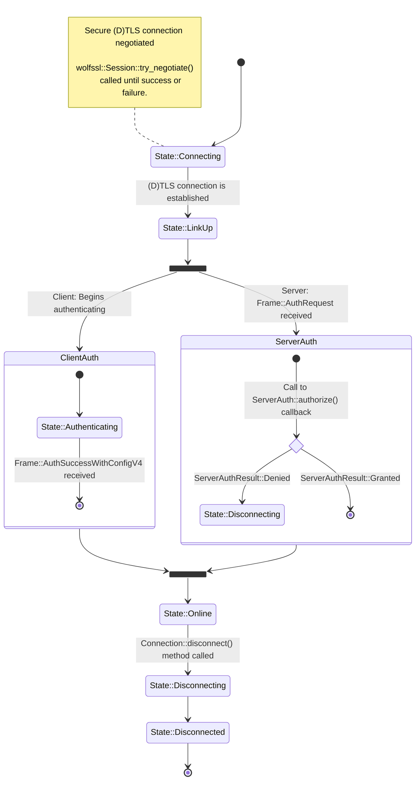

# Connection State Machine

A `lightway_core::Connection` follows a simple lifecycle, described by
the `lightway_core::State` enum.

Some transitions are ommitted for clarity:

* If no DTLS traffic is received the `Connection::tick()` can transition
  directly to `State::Disconnected` from any state.
* A call to `Connection::disconnect()` will transition to
  `State::Disconnecting`.
