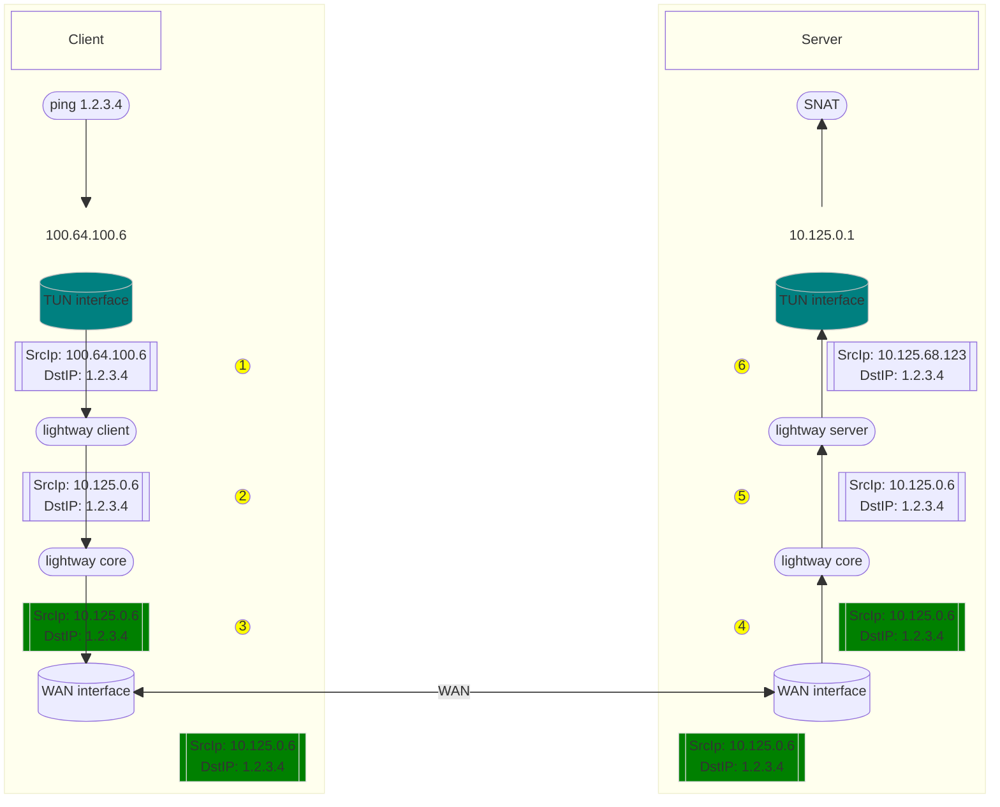

# IP Address translation

Lightway client/server supports an interesting feature called IP translation.
It helps to decouple the IP address binding between client and server.
i.e Client tunnel's IP address can be different from server tunnel's IP address.

The main advantage of this translation is to use the same tunnel IP address across
all clients connected to the server. Without the translation, each client's tunnel
IP has to be in the same network and cannot overlap.

## Implementation detail

Lightway server has following CLI config (Ref: [lightway-server/src/args.rs](../lightway-server/src/args.rs)):
- `ip_pool` - internal IP network used by server to communicate with different clients.
    - If the the tunnel IP is within the pool then it can be configured with the `tun_ip` configuration option.
    - The `ip_map` option can be use to reserve specific subranges to clients connecting to a specific incoming IP
- `lightway_server_ip`, `lightway_client_ip`, `lightway_dns_ip`- These are the values which will be sent to the client in the network config message.

Lightway client has following CLI configs (Ref: [lightway-client/src/args.rs](../lightway-client/src/args.rs)):
- `tun_local_ip` - This IP address will be configured on the client tunnel interface
- `tun_peer_ip` - Virtual peer IP used as default route
- `tun_dns_ip` - Virtual DNS IP to use. This will be changed to actual DNS IP address inside the client

Due to this IP translation, even though client and server tunnel will be in different IP network, it still behaves as it is on the same network.

### 

Steps during connection:

1. Client on startup sets the configured tun_local_ip as tunnel interface IP and uses tun_peer_ip as default route (100.64.0.6)
1. Client then connects to the server, and authenticate itself
1. Once the authentication succeeded, server allocates one internal IP address to the client from its ip_pool (10.125.68.123)
1. Server then sends the static network config message based on server configuration (ex: 10.125.0.6) 
Note: So essentially all clients will receive the same network config message. But each client will be mapped to a unique internal IP, which is visible only inside the server
1. Client after receiving this network config message, stores it. But it does not use it to configure the tunnel interface. 



### Packet flow steps (as marked yellow in above picture):
1. When we start a ping from the client device to an IP say 1.2.3.4, client OS creates a ICMP packet with src IP as tunnel IP and destination IP as actual desctination (since default route will be pointing towards tunnel) and sends the packet to the tunel interface.
1. ICMP packet will then be received by the LightwayClient. It then updates the source IP of the ICMP packet to tun_local_ip from server's network config message. The packet is then passed to lightway-core
1. Lightway-core then encapsulates the ICMP packet inside TLS/DTLS connection and forwards it to Lightway-server device
1. Lightway-core on receiving the packet, decapsulates the packet and try to forward the packet to server's tunnel interface
1. Server which provides the tun_write modifies the source IP address of ICMP packet to internal IP assigned to this client
1. The source IP of the ICMP is now within the server tunnel IP network. So the packet will be SNATted to the internet

Note: The steps will be reversed in the return packet flow from server to client.
