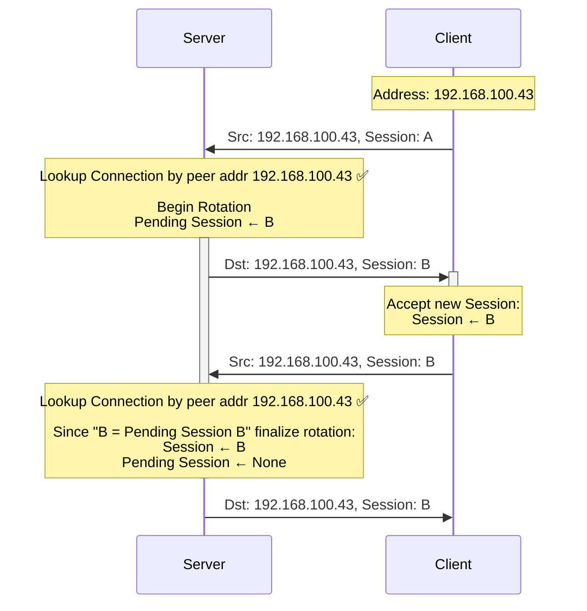
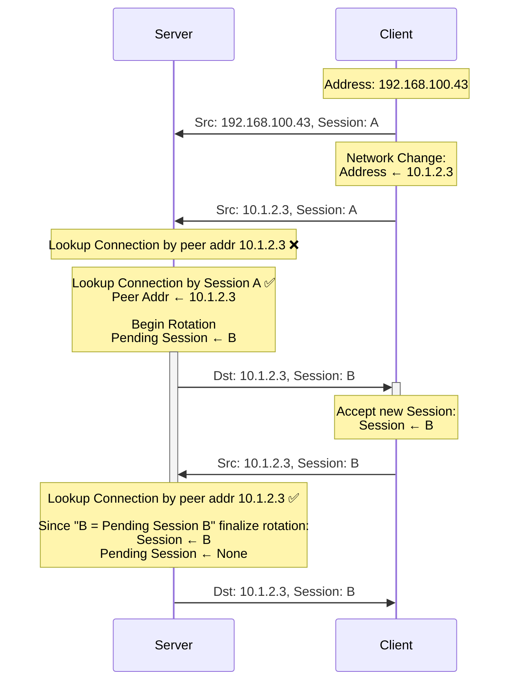
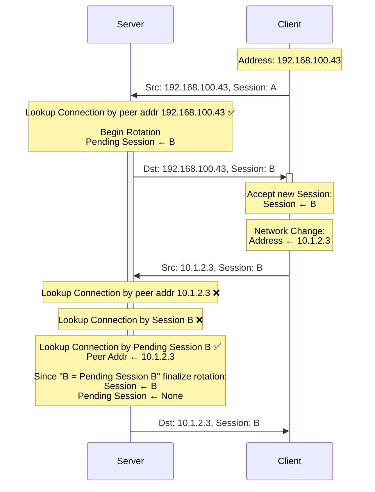
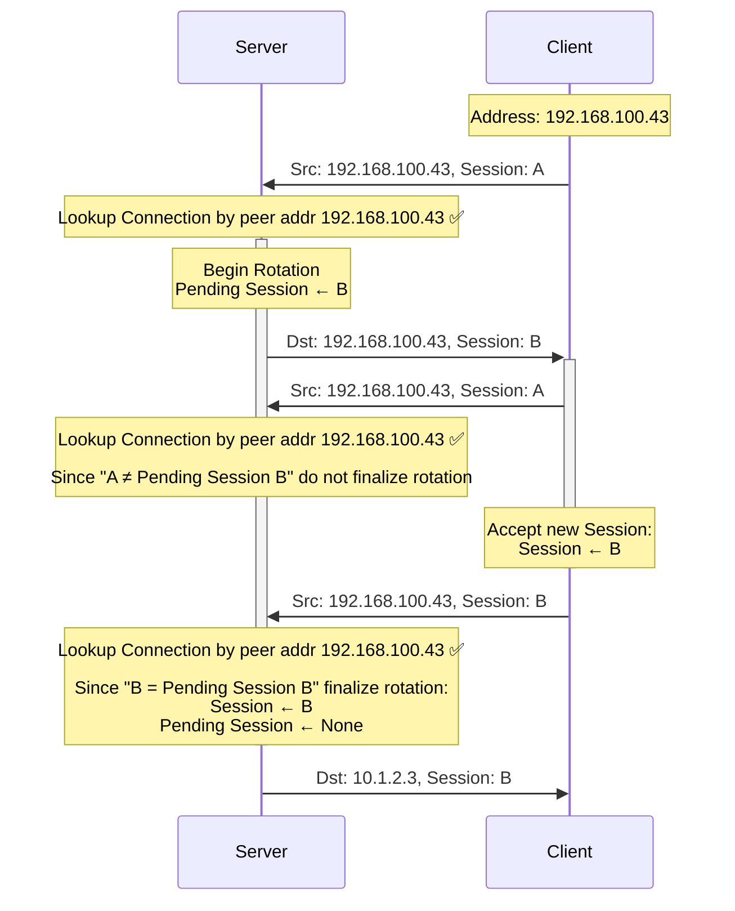
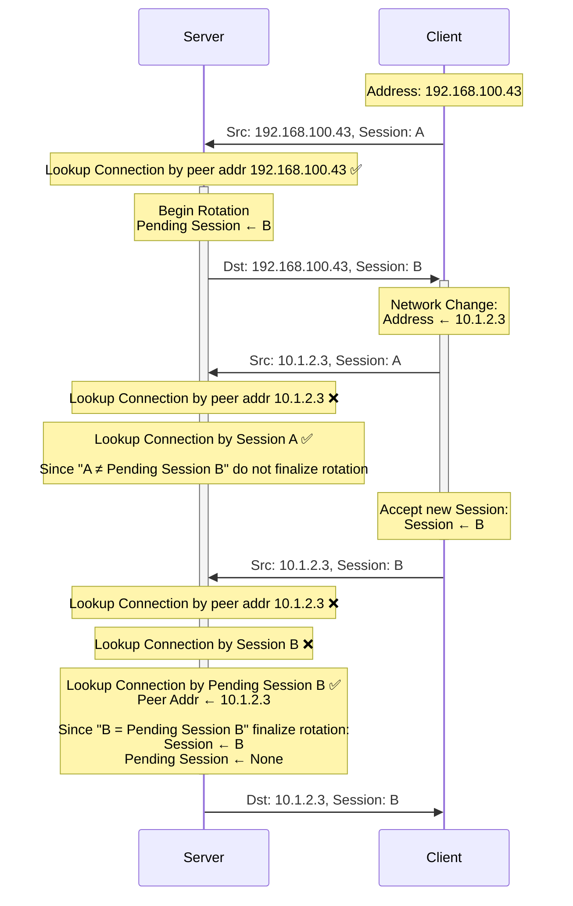

# lightway-core

## UDP Session ID Rotation

The Lightway UDP protocol includes a wire header which contains
Session ID in order to support clients floating between networks.

To improve privacy and security for users an application may choose to
rotate that UDP session ID by calling
`Connection::rotate_session_id()`.

Interesting opportunities to do so are:

* After recovering a floated session i.e. after a client network
  change.
* After updating TLS keys.

### Case 1: Rotation with no network change

The simple case where the client address does not change.



### Case 2: Rotate after client network change

The case where the client network change precipitates the session
rotation.



### Case 3: Client network change in middle of rotation

A session rotation is in flight (case 1 or 2) but a client network
change happens in the middle.



### Case 4: Raciness

Client generates new traffic before observing a rotation.



### Case 5: Raciness + Network change

Client generates new traffic before observing a rotation but after a
network change.




## Fuzzing

### `cargo-fuzz`

The wire parsing functions can be fuzzed using
[`cargo-fuzz`](https://rust-fuzz.github.io/book/cargo-fuzz.html).

A nightly toolchain is required.

```console
$ cargo install force cargo-fuzz
$ cargo +nightly fuzz run fuzz_parse_header
$ cargo +nightly fuzz run fuzz_parse_frame
```

See the `cargo fuzz` book for more information.

To create a corpus with some valid frames:

```console
$ printf "\x01" > corpus/fuzz_parse_frame/noop
$ printf "\x02\xf0\x0b\xbe\xed" > corpus/fuzz_parse_frame/ping
$ printf "\x03\xab\xcd\xef\x09" > corpus/fuzz_parse_frame/pong
$ printf "\x04\x01\x02\x06mesecret" > corpus/fuzz_parse_frame/auth_request_userpass
$ printf "\x04\x17\x00\x04\x01\x02\x03\x04" > corpus/fuzz_parse_frame/auth_request_custom_callback
$ printf "\x05\x00\x03\xfe\xbe\xaa" > corpus/fuzz_parse_frame/data
$ printf "\x061.1.1.1\x00\x00\x00\x00\x00\x00\x00\x00\x00\x00\x00\x00\x00\x00\x00\x00\x002.2.2.2\x00\x00\x00\x00\x00\x00\x00\x00\x00\x00\x00\x00\x00\x00\x00\x00\x003.3.3.3\x00\x00\x00\x00\x00\x00\x00\x00\x00\x00\x00\x00\x00\x00\x00\x00\x001500\x00\x00\x00\x00\x00\x00\x00\x00\x00\x00\x00\x00\x00\x00\x00\x00\x00\x00\x00\x00\x00\x00\x00\x00\x00\x00\x2f\x66" > corpus/fuzz_parse_frame/auto_success_with_config_v4
$ printf "\x07\x00\x00\x00\x00\x00\x00\x00\x00\x00\x00\x00\x00\x00\x00\x00\x00\x00\x00\x00\x00\x00\x00\x00\x00\x00\x00\x00\x00\x00\x00\x00\x00\x00\x00\x00\x00\x00\x00\x00\x00\x00\x00\x00\x00\x00\x00\x00\x00\x00\x00\x00\x00" > corpus/fuzz_parse_frame/auth_failure
$ printf "\x0c" > corpus/fuzz_parse_frame/goodbye
$ printf "\x0e\x00\x0dserver config" > corpus/fuzz_parse_frame/server_config
```

The [coverage documentation] seems to be out of
date. https://github.com/rust-fuzz/cargo-fuzz/issues/308 suggests
using the `llvm-cov` from the rustup nightly toolchain directory as
well as a different path to the target binary. This appears to work.

[coverage documentation]: https://rust-fuzz.github.io/book/cargo-fuzz/coverage.html
